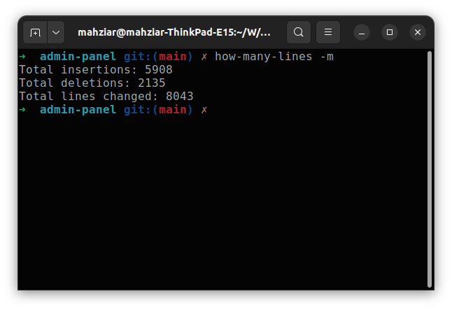

# How Many Lines?

This script named `how-many-lines.sh` calculates the total number of insertions, deletions, and lines changed in a Git project based on different time intervals.

***How many lines did I coded this month:***


## Usage

To use the script, run it with one of the following arguments:

- `-d`: Total lines changed today
- `-w`: Total lines changed this week

- `-m`: Total lines changed this month
- `-y`: Total lines changed this year

Example:
```bash
./how-many-lines.sh -d
```

## Make Script Global

```bash
sudo chmod +x how-many-lines.sh
sudo cp how-may-lines.sh /usr/bin/how-many-lines
```